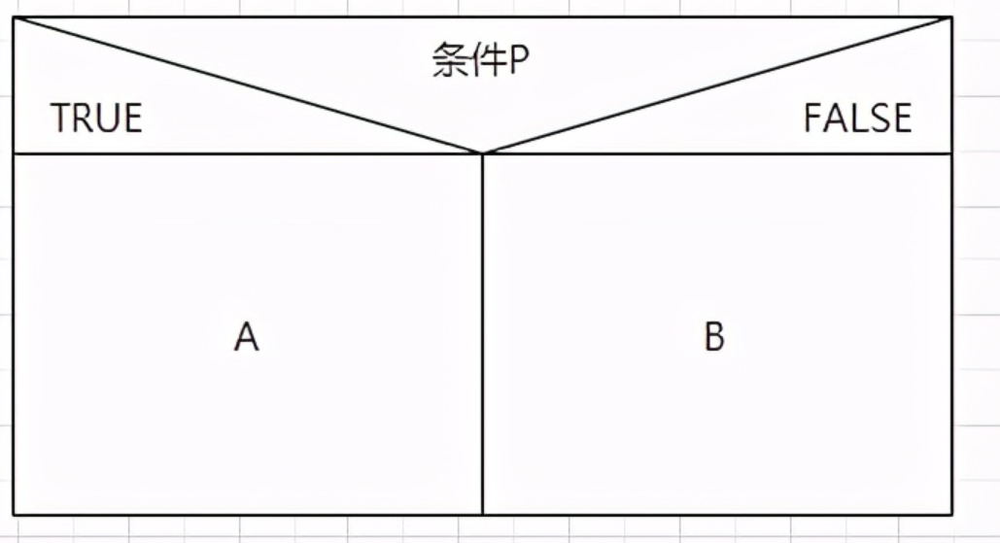
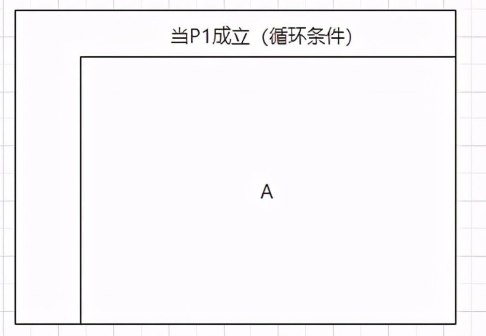
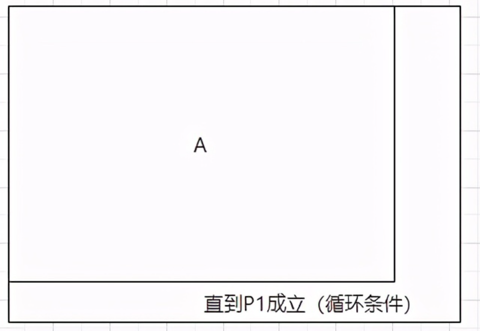
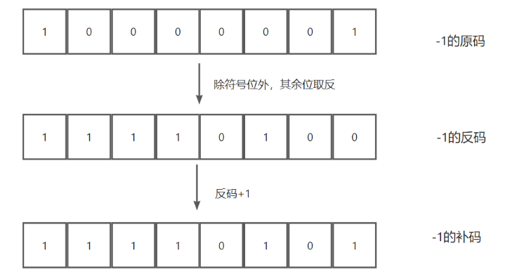
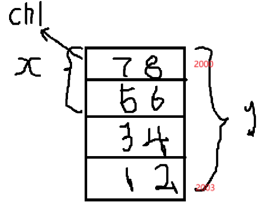

## 输入输出

### 输入

1. scanf 后面必须是地址
2. " "中不能出现与%无关的
3. 只接收空格前的字符
4. gets只接收回车之前的字符

### 输出

1. printf括号中的内容，可以为一项，也可以为两项；如果只有一项，输出“”中的内容；如果为两项，按照格式输出
2. %s 后面必须跟地址
3. %开头的是格式控制符
4. 格式控制符、转义字符、普通字符


## 进制转换

基数：指各种进位记数制中允许选用基本数码的个数。

​			例：十进制的数码有：0，1，2，3，4，5，6，7，8，9 --> 基数是10

位权：每个数码所表述的数值等于该数码乘以一个与数码所在位数相关的常数，这个常数叫做权值

权重：一个数位在特定进制中所占的权重。

​			以二进制为例：2^n，n是该位的索引，整数从右向左，索引从0开始，小数从左向右，索引从-1开始

1. 二、八、十六 ---> 十

   按权展开，相加即得

2. 十 ---> 二、八、十六
   除2、8、16取余

3. 二 ---> 八
   从右向左，3位二进制数为一组（不足时补0），按权展开，相加得到一位八进制数

4. 二 ---> 十六

   从右向左，4位二进制为一组（不足补0），按权展开，相加得一位十六进制数

5. 八 ---> 二

   八进制数除2取余得到二进制数，每个八进制数为3个二进制数，不足时，在最左边补0

6. 十六 ---> 二
   十六进制数除2取余，得出二进制数，每个十六进制数为4个二进制数，不足时，在最左边补0

7. 八 ---> 十六

   8 --> 2, 2-->16, 小数点位置不变

8. 十六 ---> 八

   16 --> 2, 2 --> 8, 小数点位置不变


带小数的进制转换

1. 任意进制 ---> 十进制数

   整数位不变按权展开，相加即得；小数位索引从-1开始，按权展开相加即得

2. 十 ---> 任意进制数
   乘基数，取整数，正写（从上往下写）

   以10 --> 2 为例，0.625 --> 0.101


## 数据类型

### 基本数据类型

整型：

实型：

字符型：

### 构造类型

- 数组
- 结构体
- 共用体
- 枚举类型


### 常量

==在程序执行期间其值保持不变的量==

- 整型常量：1000，132，0，-345

  - 十进制整数：14534
  - 八进制...：354，077
  - 十六进制...：0x234
  - 长整型 l   无符号整型 u   无符号长整型 ul

- 实型(浮点)...：12.34e^3(代表12.34*10^3)

  - 十进制小数形式：0.123,  .23, 234. ,  0.0 , -2.5, ...
  - 指数形式：0.91*10^-3 --> 0.91E-3  <u>(e的前后必须有数，e的后面必须是整数)</u>

- 字符...：'a', 'A', '9', '?'  合法  ||  "A", '999'  非法

  - 

  - | 转义序列     | 含义                       |
    | :----------- | :------------------------- |
    | `\\`         | \ 字符                     |
    | `\ '`        | ' 字符                     |
    | `\"`         | " 字符                     |
    | `\?`         | ? 字符                     |
    | `\a`         | 警报铃声                   |
    | `\b`         | 退格键                     |
    | `\f`         | 换页符                     |
    | `\n`         | 换行符                     |
    | `\r`         | 回车                       |
    | `\t`         | 水平制表符                 |
    | `\v`         | 垂直制表符                 |
    | `\345`       | 一到三位的八进制数         |
    | `\x45 . . .` | 一个或多个数字的十六进制数 |

- 字符串...："boy"

  - 字符串常量在内存中以null终止符 \0 结尾（也就是说："boy"的长度为3，占用空间为4）

- 符号常量：用标识符表示的常量（预处理命令） `#define  标识符 常量` 

  - 例(定义)：`#define  PI 3.1415926` 
  - `#`开头，后面没有分号
  - 定义的名称一般是大写
  - 替换是简单替换
  - 一个#define命令只能定义一个符号常量，用一行书写


## 运算符

| 类别       | 运算符                            | 结合性          |
| :--------- | :-------------------------------- | :-------------- |
| 后缀       | () [] -> . ++ - -                 | 从左到右        |
| 一元       | + - ! ~ ++ - - (type)* & sizeof   | :car:`从右到左` |
| 乘除       | * / %                             | 从左到右        |
| 加减       | + -                               | 从左到右        |
| 移位       | << >>                             | 从左到右        |
| 关系       | < <= > >=                         | 从左到右        |
| 相等       | == !=                             | 从左到右        |
| 位与 AND   | &                                 | 从左到右        |
| 位异或 XOR | ^                                 | 从左到右        |
| 位或 OR    | \|                                | 从左到右        |
| 逻辑与 AND | &&                                | 从左到右        |
| 逻辑或 OR  | \|\|                              | 从左到右        |
| 条件       | ?:                                | :car:`从右到左` |
| 赋值       | = += -= *= /= %=>>= <<= &= ^= \|= | :car:`从右到左` |
| 逗号       | ,                                 | 从左到右        |


## 算法

> 按照一定的规则来解决的某一类问题的明确和有限的步骤，这些步骤必须是明确和有效的，而且能够在有限步之内完成


### 描述算法的方式：

1. 自然语言

2. 流程图（程序框图）

3. N-S图

   1. 顺序结构（所有语句顺序执行，先执行A后执行B）

      

   2. 选择结构（如果条件P成立，执行A，否则执行B）

      

   3. 循环结构

      1. 当型循环结构（先判断后执行，当P1条件成立的情况下，反复执行A语句，直到P1条件不成立为止）

        

      2. 直到型循环结构（先执行后判断，当P1条件不成立的情况下，反复执行A语句，直到P1条件成立为止）

        


### 算法特性：

1. 有穷性：有限的步骤
2. 确定性：每一步都有明确的意义
3. 有零个或多个输入
4. 有一个或多个输出 （没有输出的算法是没有意义的）
5. 有效性


## 原码 反码 补码

==计算机数据的存储使用二进制'补码'形式存储==

### 正数

正数的 原码反码补码 都相同。 

> 举个栗子：+5

●原码：00000101

●反码：00000101

●补码：00000101

### 负数

原码：将一个整数的绝对值转换成二进制，再在最高位上加上符号位（0表示正数，1表示负数）

反码：原码取反得到。
			对于负数 符号位保持不变，其余位取反。

补码：旨在解决负数在计算机中的表示问题，并且能够是减法运算变得简单而引入的。
			对于负数，补码是其反码加1。

> 举例：



补码的取值范围是 [-2^n-1, (2^n-1) - 1] ，可以表示最多的整数，而且符号位参与运算不会出错。


### 计算

在<u>原码</u>表示下，计算`-1+1`等于`-2`

在<u>反码</u>表示下，计算`-1+1`等于`-0`

在<u>补码</u>表示下，计算`-1+1`等于`0`


**因此使用补码表示负数可以==实现负数的加法运算，而且不存在两个补码相加溢出的情况。==**

**此外，补码还能充分利用计算机硬件进行数学运算，因此在计算机系统中==广泛采用补码表示有符号整数。==**


## 循环


### switch

多分支选择结构（开关结构）

> 分数 A: 85up   b: 70~84  C: 60~69  D: 60down

```c
#include<stdio.h>
int main() {
    char grade;
    scanf("%c",&grade);
    printf("Your score");
    switch(grade)
    {
	    case 'A': printf("85~100\n");break;
        case 'B': printf("70~84\n");break;
        case 'C': printf("60~69\n");break;
        case 'D': printf("<60\n");break;
        default: printf("enter data error!\n");
    }
    return 0;
}
```

> 输入一个百分制成绩，90upA，80~89B，70~79C，60~69D，60downE

```c
int main(int argc, char const *argv[])
{
    int grade;
    printf("your score: ");
    scanf("%d", &grade);
    switch (grade / 10)
    {
    case 10:
    case 9:
        printf("A\n");
        break;
    case 8:
        printf("B\n");
        break;
    case 7:
        printf("C\n");
        break;
    case 6:
        printf("D\n");
        break;
    case 5:
        printf("E\n");
        break;
    default:
        printf("error!\n");
        break;
    }
    return 0;
}
```

> 输入整型x，判断2 to x内的数是素数还是非素数 并输出（用while循环实现，，用函数调用）

```c
//n-1、2ton/2、2to根号n
int su(int n)
{
    int j=2;
    while(j<=n-1) {
        if(n%j==0) break;
        j++;
    }
    if(j==n) return 1;
    else return 0;
}
int main(int argc, char const *argv[])
{
    int x, i=2, y;
    scanf("%d", &x);
    while (i<=x)
    {
        y=su(i);
        if (y==1)
        {
            printf("%d yes");
        }else printf("%d no");
        
    }

    return 0;
}
```

> 输出所有的水仙花数，（水仙花数：三位整数，每一位的立方和等于该数）。

```c

```


### while

编程的时候出现一正一负，需要添加符号变量`f=-f`

```c
int main(int argc, char const *argv[])
{
    //1-2+3-4+5...+99-100
    int i =1, sum = 0, f=1;
    while (i<=100)
    {
        sum = sum +i*f;
        i++;
        f=-f;
    }
    printf("sum=%d\n", sum);
    return 0;
}
```


### do-while

先执行一次程序(do)，再执行循环(while)

```c
#include<stdio.h>
int main() {
    do{
        sum=sum+i;
        i++;
    }while(i<=100);
    printf("sum=%d\n",sum);
    return 0;
}
```


### for


```c
for(i=1;i<=100;i++) {
    printf("%d", i);
}
```


### break

提前终止循环

### continue

提前结束本次循环


## 指针


### 指针的概念

1. 指针就是地址，指针变量就是地址变量
2. 使用指针可以应用简单变量的值
3. *有三种含义：
   1. 定义语句中指针类型说明符
   2. 执行语句中，丹麦运算符表指针运算符 去内容
   3. 。。。。。，双目运算符，算乘

4. *和&遇在一起，如果 *在&前面，二者可以抵消，反之则不抵消


### 指针引用数组元素

==数组名本身是一个指向数组首元素的指针==

#### (1) 通过数组下标访问元素

最常见的方式是直接使用数组下标运算符：

```c
int value = arr[2];  // 获取 arr[2] 的值，结果为 30
```

#### (2) 通过指针引用数组元素

通过指针，也可以访问数组中的元素。比如：

```c
int *p = arr;  // p 指向 arr[0]
int value = *(p + 2);  // 访问 arr[2]，结果为 30
```

其中，`p + 2` 表示指针 `p` 向前偏移 2 个元素的位置，然后通过 `*` 解引用访问该元素的值。

#### 选择排序

```c
#include<stdio.h>
int main() 
{
    void sort(int x[], int n);
    int i, *p, a[10];
    p = a;
    
    //输入10个数
    printf("输入10个数: \n");
    for(i = 0; i<10; i++) scanf("%d", p++);
    p=a;
    
    //对数组进行排序
    sort(p, 10);
    
    //输出排序后的数组
    printf("排序后的数组：\n");
    for(p=a,i=0; i<10; i++) {
        printf("%d", *p);
        p++;
    }
    
    printf("\n");
    
    return 0;
}

void sort(int x[], int n) {
    int i, j, k, t;
    for(i=0; i<n-1; i++) {
        k = i;
        for(j=i+1;j<n;j++) 
            if(x[j]>x[k]) k=j;
        if(k!=i) {
            t=x[i];
            x[i]=x[k];
            x[k]=t;
        }
    }
}
```


### 指针引用函数参数

> 通过指针引用数组参数

当我们把数组传递给函数时，实际上传递的是数组首元素的地址。因此数组参数本质上是指针，指向数组的第一个元素。

例子：通过指针访问和修改数组参数

```C
#include <stdio.h>

// 通过指针修改数组元素
void modifyArray(int *arr, int size) {
    for (int i = 0; i < size; i++) {
        arr[i] = arr[i] * 2;  // 每个元素乘以 2
    }
}

int main() {
    int arr[5] = {1, 2, 3, 4, 5};

    printf("Before modification:\n");
    for (int i = 0; i < 5; i++) {
        printf("%d ", arr[i]);
    }

    modifyArray(arr, 5);  // 传递数组的首地址

    printf("\nAfter modification:\n");
    for (int i = 0; i < 5; i++) {
        printf("%d ", arr[i]);
    }

    return 0;
}
```

输出结果：

```c
Before modification:
1 2 3 4 5
After modification:
2 4 6 8 10
```

在这个例子中，modifyArray 函数接收了数组 arr 的首地址，并通过指针修改了数组的每个元素。需要注意的是，数组名作为参数实际上是数组首元素的指针。


### 指针引用多维数组

二级地址和一级地址不能直接赋值


！！`*(*(p+1)+j)`与`*a[i][j]`一致


> **3个同学各学4门课，计算总平均分以及第n个学生的成绩**

```c
//指针法
#include<stdio.h>

// 计算总平均分
void average(float *p, int n) {
    float sum = 0;
    for (int i = 0; i < n * 4; i++) {
        sum += *(p + i);  // 使用指针来访问每个学生的成绩
    }
    printf("Total average score: %.2f\n", sum / (n * 4));  // 总平均分
}

// 查找并输出第 n 个学生的成绩
void search(float (*p)[4], int n) {
    printf("The scores of student %d are: ", n + 1);
    for (int i = 0; i < 4; i++) {
        printf("%.2f ", *(*(p + n) + i));  // 使用指针访问第 n 个学生的每门成绩
    }
    printf("\n");
}

int main() {
    float score[3][4] = { {65, 67, 70, 60}, {80, 87, 90, 81}, {90, 99, 100, 98} };
    average((float *)score, 3);  // 计算总平均分
    int student;
    printf("Enter the student number (1-3) you want to search: ");
    scanf("%d", &student);
    
    if (student >= 1 && student <= 3) {
        search(score, student - 1);  // 查找并打印第 student 个学生的成绩
    } else {
        printf("Invalid student number.\n");
    }

    return 0;
}
```


```c
//数组下标法
#include <stdio.h>

void average(float score[3][4], int n);  // 函数声明
void search(float score[3][4], int n);   // 函数声明

int main()
{
    float score[3][4] = {
        {65, 67, 70, 60},
        {80, 87, 90, 81},
        {90, 99, 100, 98}
    };
    int n;

    // 计算总平均分
    average(score, 3);

    // 查询第n个学生的成绩
    printf("请输入要查询的学生编号(1-3): ");
    scanf("%d", &n);
    if (n >= 1 && n <= 3) {
        search(score, n - 1);
    } else {
        printf("无效的学生编号\n");
    }

    return 0;
}

// 计算所有学生的总平均分
void average(float score[3][4], int n)
{
    float sum = 0.0;
    int i, j;

    for (i = 0; i < n; i++) {
        for (j = 0; j < 4; j++) {
            sum += score[i][j];
        }
    }

    printf("所有学生的总平均分为: %.2f\n", sum / (n * 4));
}

// 查询第n个学生的成绩
void search(float score[3][4], int n)
{
    int j;
    printf("学生%d的成绩为:\n", n + 1);
    for (j = 0; j < 4; j++) {
        printf("课程%d: %.2f\n", j + 1, score[n][j]);
    }
}

```

> 输入五个整数，输出最大的数

```C
#include<stdio.h>
int main() {
    int a[5]={34,23,52,-24,99};
    int i, max=a[0];
    for(i=0;i<5;i++){
        if(a[i]>max)
            max=a[i];
        prinf("max is%d\n",max);
    }
}
```


指针引用字符串


> 定义一个字符数组，在其中存放字符串" I love China! "，输出该字符串和第八个字符。

```C
#include<stdio.h>
int main() {
    chat string[14]="I love China!";
    printf("%s", string);
    printf("%c", string[7]);
    return 0;
}
```

 

> 将字符串a赋值为字符串b，然后输出字符串b

```C
#include<stdio.h>
int main() {
    char a[]="I am a student.", b[20];
    int i;
    for(i=0;*(a+i)!='\0';i++) *(b+i)=*(a+i);
    *(b+i)='\0';
    printf("string a is:%s\n", a);
    printf("string b is:%s\n", b);
    return 0;
}
```


### 指针数组和多重指针


#### 什么是指针数组

一个数组，若其元素均为指针类型数据，称为指针数组，也就是说：指针数组中的每一个元素都存放一个地址，相当于一个指针变量。

```c
定义只为指针数组的一般形式为：
    
	类型名 *数组名[数组长度]
    int *p[4];
```


```C
#include<stdio.h>
#include<string.h>
int main() {
    void sort(char *name[], int n);
    void print
    
    char *name[]={"Follow","Great","FORTRAN","Computer"};
}

void sort(char *name[], int n) {
    char *temp; int i, j, k;
    for(i=0;i<n-1;i++) {
        k=i;
        for (j=i+1;j<n;j++)
            if(strcmp(name[k], name[j]>0)) k=j;
        if(k!=i) {
            temp=name[i]; 
            name[i]=name[k]; 
            name[k]=temp;
        }
    }
}
```

#### 指向指针数据的指针

> 例：只用指向指针数据的指针变量

```C
char *name[]={"Follow","Freat","FORTRAN","Computer"};
char **p;
int i;
for(i=0;i<5;i++) {
    p=name+i;
    printf("%s\n", *p);
}
```


#### 指针数组作main函数的形参

指针数组的一个重要应用是作为main函数的形参，在以往的程序中，main函数的第一行，

```c
#include<stdio.h>
int main(int argc, char *argv[])
{
    /* code */
    return 0;
}
```


### 动态内存分配与指向它的指针变量

#### 怎样建立内存的动态分配

对内存的动态分配是通过系统提供的库函数来实现的，主要有==malloc，calloc，free，realloc==这4个函数

#### malloc函数

函数原型：

```c
void *malloc(unsigned int size);
```

- 作用是在内存的动态存储区中分配一个长度为size的连续空间
- 函数的值是所分配区域的第一个字节的地址，或者说，此函数是一个指针型函数，返回的指针指向该分配域的开头位置


#### calloc函数

函数原型：

```c
void *calloc(unsigned n, unsigned size);
```

- 作用是 在内存的动态存储区中分配n个长度为size的连续空间，这个空间一般比较大，足以保存一个数组。

例：p=calloc(50, 4);

开辟50*4个字节的临时分配域，把起始地址续给指针变量p


#### free函数

函数原型：

```c
void free(void *p);
```

- 释放指针变量p所指向的动态空间，是这个空间能重新被其他变量使用。p应是最近一次调用calloc或malloc函数时得到的函数返回值。


#### realloc函数

函数原型：

```c
void *realloc(void *p, unsigned int size);
```

- 如果已经通过malloc函数或calloc函数获得了动态空间，想改变其大小，可以用realloc函数重新分配。


<u>_以上4个函数的声明在`stdlib.h`头文件中_</u>


| void *calloc(size_t nitems, size_t size) | 分配所需的内存空间，并返回一个指向它的指针。                 |
| ---------------------------------------- | ------------------------------------------------------------ |
| void *malloc(size_t size)                | 分配所需的内存空间，并返回一个指向它的指针。                 |
| void free(void *ptr)                     | 释放之前调用 *calloc、malloc* 或 *realloc* 所分配的内存空间。 |
| void *realloc(void *ptr, size_t size)    | 尝试重新调整之前调用 *malloc* 或 *calloc* 所分配的 ptr 所指向的内存块的大小。 |


## 结构体（数据模型）


### 定义和使用结构体变量

#### 定义结构体

声明结构体一般形式：

```c
struct student {
    //成员列表
    int num; //类型名 成员名;
    char name[20];
    char sex;
    int age;
    float score;
    char addr[30];
} variable-list;
```

#### 定义变量

```c
struct Student student1,student2;
```

#### 字节对齐原则：

正常是将结构体中的所有成员变量的字节大小相加
但是按照字节对齐原则，是按照成员列表中最大的数据类型的倍数得出

案例：

```c
#include <stdio.h>
int main()
{
    struct sc
    {
        char a[13];
        double b;
    } ks;

    printf("%d\n", sizeof(ks));
    return 0;
}

//上述原则上的字节数是21，按照字节对齐原则的字节数是24
```


在C语言中，字节对齐（byte alignment）是为了提升内存访问效率的一种优化策略，硬件通常会要求数据按照特定的边界进行对齐。字节对齐的基本原则如下：

1. **自然对齐原则**：每种数据类型的存储地址应该是该数据类型大小的整数倍。比如，`int`类型的变量通常需要在4字节边界上对齐，而`double`类型的变量通常需要在8字节边界上对齐。
2. **结构体对齐**：结构体中的每个成员需要按照其自身的对齐要求进行排列，同时，整个结构体的大小应该是最大对齐要求的倍数。为了满足这个要求，编译器会在必要的时候在结构体成员之间或末尾插入填充字节（padding bytes）。
3. **对齐的关键字**：C语言中，可以通过`#pragma pack`或者`__attribute__((packed))`来调整对齐方式。使用这些机制可以控制编译器的对齐行为，减少或取消填充字节。
4. **平台相关**：字节对齐的细节依赖于具体的硬件平台和编译器。不同的系统可能有不同的对齐要求，某些硬件架构可能要求更严格的对齐规则。

通过正确的字节对齐，可以减少内存访问的次数，提升程序性能，但也可能导致内存空间的浪费（因为引入了填充字节）。


#### 不指定类型名的缺点：

1. 必须在声明时添加结构体变量`variable-list(变量列表)`
2. 后续不能再添加结构体变量：student3等。


#### 初始化与引用

> 把一个学生的信息（包括学号、姓名、性别、住址）放在一个结构体变量中，然后输出这个学生的信息。

```c
#include<stdio.h>
int main() {
    
    struct Student {
        long int num;
	    char name[20];
    	char sex;
	    char addr[30];
    }a={10101,"Li Lin","M","123 Beijing Road"};

    printf("NO.:%ld\nname:%s\nsex:%c\naddress:%s\n", a.num,a.name,a.sex,a.addr);
    return 0;
}
```


### 使用结构体数组

#### 定义结构体数组

> 3个候选人，选民只能投票选一人，要求编一个统计选票的程序，向后输入被选人的名字，最后输出各人得票结果。

```c
#include<stdio.h>
#include<string.h>

struct Person
{
    char name[20];
    int count;
}leader[3]={"Li",0,"zhang",0,"Sun",0};

int main() {
    int i,j;
    char leader_name[20];
    for (i = 1; i <= 10; i++)
    {
        /* code */
        scanf("%s", leader_name);
    }
    
}
```


#### 结构体数组的应用举例

？？。。。？？


### 结构体指针


### 用指针处理链表


## 共用体（数据模型）

### 什么是共用体类型

一般形式：

```c
union Data
{
   int i;
   float f;
   char  str[20];
} data;
```


#### 共用体和结构体区别

1. 类型名不同：结构体(struct)，共用体(union)。
2. 共用体所占用空间(内存长度) == 最长成员的长度


### 应用共用体变量的方式

```c
int main()
{
    union emp
    {
        struct
        {
            int x;
            int y;
        } stc;
        int a;
        int b;
    } u;
    u.a = 1;
    u.b = 2;
    u.stc.x = u.a + u.b;
    u.stc.y = u.a + u.b;
    printf("%d,%d\n", u.stc.x, u.stc.y);
}

//输出结果：4,8
//原因：共用体占用内存为8，int a, int b, int x所占用内存都为4，共用前4个字节，
//	   所以当u.a=1时，a b x值都为1，u.b=2时，a b x值都为2，所以u.stc.x=u.a+u.b=2+2=4
//	   此时，a b x值都为4，所以u.stc.y=u.a+u.b=4+4=8
//	   所以结果为：4,8
```

  ```c
int main()
{
    union
    {
        /* data */
        short int x;
        long y;
        unsigned char ch1;
    } w;
    w.y = 0x12345678;
    printf("%x\n", w.y);
    printf("%x\n", w.x);
    printf("%x\n", w.ch1);
}

  ```

==字节存储，高位字节放在高地址，低位字节放入低地址==



```c
int main()
{
    struct emp
    {
        union
        {
            int x;
            int y;
        } u;
        int a;
        int b;
    } s;
    s.a = 1;
    s.b = 2;
    s.u.x = s.a + s.b;
    s.u.y = s.a * s.b;
    printf("%d,%d\n", s.u.x, s.u.y);
}

//结果为: 2,2
```


### 共用体类型数据的特点


## 枚举 enum

枚举：把可能的值一一列举出来，变量的值只限于列举出来的值的范围内。


一般形式：

```c
//声明语句
enum 枚举类型名 {枚举元素1,枚举元素2,……};
enum Weekday {sun, mon, tue, wed, thu, fri, sat};

//定义变量
enum Weekday workday, weekend, 枚举变量3,……;
```


## 用typedef声明新类型名

1. 简单的用一个新的类型名代替原有的类型名

   ```c
   typedef int Integer;
   typedef float Real;
   int i,j;
   float a,b;  // 与  Integer i,j; Real a,b;  等价
   ```

2. 命名一个简单的类型名代替复杂的类型表示方法

   
