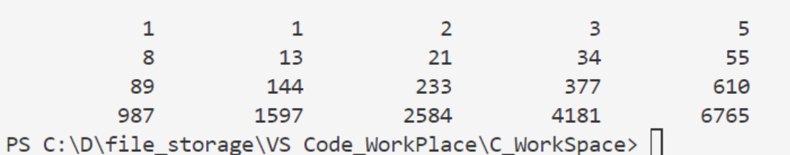

#### Fibonacci数列

使用数组，求解Fibonacci数列，即 1  1  2  3  5  8  13

```c
#include<stdio.h>
int main() {
    int i;
    int f[20] = {1,1};
    for(i=2;i<20;i++) f[i] = f[i-2] + f[i-1];
    for(i=0;i<20;i++) {
        if(i%5==0) printf("\n");
        printf("%12d", f[i]);
    }
}
```



#### :star:冒泡排序

分为升序（默认）和降序

抽象为对n个数排序

==大数沉淀，小数起泡==

```c
#include <stdio.h>
int main()
{
    int a[10], i, j, t;
    printf("put 10 numbers: \n");
    for (i = 0; i < 10; i++)
        scanf("%d", &a[i]);
    printf("\n");

    for (j = 0; j < 9; j++)
        for (i = 0; i < 9 - j; i++)
            if (a[i] > a[i + 1])
            {
                t = a[i];
                a[i] = a[i+1];
                a[i+1] = t;
            }
    printf("the sorced numbers: \n");
    for (i = 0; i < 10; i++)
    {
        printf("%d", a[i]);
        printf("\n");
    }
        
    return 0;
}
```

